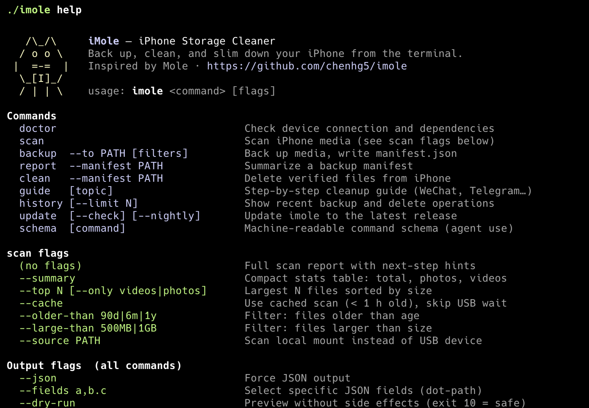

<div align="center">
  <h1>iMole</h1>
  <p><em>🐹 Back up, clean, and slim down your iPhone from the terminal.</em></p>
  <p style="font-size:1.1em; color:#aaaaaa;">Inspired by <a href="https://github.com/tw93/mole">Mole</a></p>
</div>

<p align="center">
  
</p>

<p align="center">
  <a href="https://github.com/chenhg5/imole/stargazers"></a>
  <a href="https://github.com/chenhg5/imole/releases"></a>
  <a href="LICENSE"></a>
  <a href="https://github.com/chenhg5/imole/commits"></a>
  <a href="https://t.me/+ZpgBu1dlmCszODBl"></a>
</p>

> **Free up your iPhone without buying more iCloud.** iMole scans what's eating your iPhone storage, backs up photos and videos to your computer, verifies each file, and then safely deletes the originals from the device — all from a single command.

## Quick Start

**Give an LLM this → it handles everything:**

```
Back up all photos and videos older than 6 months from my iPhone to ~/backup,
then delete the originals to free up space
```

```
Scan my iPhone storage and tell me which apps are taking up the most space,
then suggest what I can safely remove
```

```
I just got back from Japan — back up all my photos and videos and delete
the originals from my iPhone
```

```
Free up 50GB from my iPhone by backing up old videos and photos, then
deleting the verified backups
```

**Install**

```bash
curl -fsSL https://raw.githubusercontent.com/chenhg5/imole/main/install.sh | bash
```

**Or: do it manually**

```bash
imole doctor                                           # check device is connected

imole scan --summary                                   # see media + app storage
# Total:   38,421 files · 286.4 GB
# Videos:   1,204 files · 172.8 GB
# Photos:  37,217 files · 113.6 GB

imole scan media --summary                             # media-only summary
imole scan --top 10 --only videos                      # find the biggest culprits
imole scan apps --top 20                               # rank app storage usage

imole backup --to ~/iphone-backup --file DCIM/202507__/IMG_7523.MOV --dry-run # preview one file
imole backup --to ~/iphone-backup --only videos --older-than 90d --dry-run   # preview
imole backup --to ~/iphone-backup --only videos --older-than 90d              # back up

imole report --manifest ~/iphone-backup/manifest.json  # confirm all verified

imole clean  --manifest ~/iphone-backup/manifest.json  # delete from iPhone
imole clean  --manifest ~/iphone-backup/manifest.json --file DCIM/202507__/IMG_7523.MOV --dry-run # preview deleting one verified file
# → on iPhone: Photos → Recently Deleted → Delete All  → space freed 🎉
```

## Features

- **Space diagnosis** — scan DCIM over USB, rank by size, filter by age or kind
- **App storage ranking** — show iOS-reported App/Data usage with `imole scan apps`
- **Smart backup** — copy to any local path, organized by year/month, verify by size
- **Manifest** — every backup writes a `manifest.json` with source path, size, and verification status
- **Safe deletion** — `imole clean` only deletes files that are `verified: true` in the manifest
- **Cross-platform** — macOS (ImageCaptureCore, native USB), Linux (gphoto2 / ifuse), Windows (`--source PATH`)
- **Agent-friendly** — `--json` output, `--fields` selection, `imole schema` for machine-readable API surface
- **Operation log** — `imole history` shows what was backed up and deleted

## Platform Support

| Feature | macOS | Linux | Windows |
|---------|:-----:|:-----:|:-------:|
| USB auto-scan | ✅ ImageCaptureCore | ✅ gphoto2 | ➖ |
| Scan via `--source PATH` | ✅ | ✅ | ✅ |
| Backup (copy + verify) | ✅ | ✅ | ✅ |
| Delete via USB (native) | ✅ ImageCaptureCore | ❌ | ❌ |
| Delete via `--source PATH` | ✅ | ✅ ifuse | ✅ iTunes mount |
| Device detection | ✅ | ✅ | ✅ |
| App storage ranking | ✅ ideviceinstaller | ✅ ideviceinstaller | ➖ |

## Install

### npm (recommended — works on macOS, Linux, and Windows)

```bash
npm install -g @getimole/imole
```

Works on all platforms with Node.js installed. Downloads the pre-built binary automatically.

### Script (macOS / Linux)

```bash
curl -fsSL https://raw.githubusercontent.com/chenhg5/imole/main/install.sh | bash
```

### Homebrew (macOS, coming soon)

```bash
brew install imole
```

### From source

```bash
go install github.com/chenhg5/imole/cmd/imole@latest
```

## Command Preview

<p align="center">
  
</p>

## Dependencies

**macOS** — no extra installs needed for media scan/backup. ImageCaptureCore is built in. For device and app storage info:

```shell
brew install libimobiledevice   # optional, for imole doctor device details
brew install ideviceinstaller   # optional, for imole scan apps
```

If `ideviceinstaller` is missing, `imole scan --summary` still prints the media
summary and marks app storage as unavailable. Only `imole scan apps` requires
`ideviceinstaller`.

`imole scan apps` uses iOS installation_proxy `StaticDiskUsage` and
`DynamicDiskUsage`. These fields are useful for ranking, but can underreport
apps that store data in shared App Group containers. Chat apps such as WeChat
may show less than iPhone Settings → General → iPhone Storage.

**Linux**

```shell
sudo apt install libimobiledevice-utils gphoto2   # USB scan
sudo apt install ifuse                             # mount DCIM as filesystem
```

> **Full backup + delete workflow via ifuse:**
> ```shell
> idevicepair pair                                  # one-time trust pairing
> mkdir -p ~/iphone && ifuse ~/iphone               # mount
> imole backup --source ~/iphone/DCIM --to ~/iphone-backup
> imole clean  --manifest ~/iphone-backup/manifest.json --source ~/iphone/DCIM
> fusermount -u ~/iphone                            # unmount when done
> ```

**Windows** — install iTunes (provides USB drivers and mounts the iPhone as a browsable device):

> **1.** Install iTunes, connect iPhone, unlock and tap "Trust This Computer"  
> **2.** Open Windows Explorer → This PC → [iPhone] → Internal Storage → DCIM  
> **3.** Note the path shown in the address bar, e.g. `\\Apple\iPhone\Internal Storage\DCIM`

```powershell
# Scan
imole.exe scan --source "\\Apple\iPhone\Internal Storage\DCIM"

# Backup
imole.exe backup --source "\\Apple\iPhone\Internal Storage\DCIM" --to C:\iphone-backup

# Delete verified files (space freed immediately)
imole.exe clean --manifest C:\iphone-backup\manifest.json --source "\\Apple\iPhone\Internal Storage\DCIM"
```

## Commands

```bash
imole doctor                        # Check device connection and dependencies
imole scan    [flags]               # Scan report (summary, top N, or full)
imole backup  --to PATH [filters]   # Back up matching media, write manifest.json
imole report  --manifest PATH       # Summarize a backup manifest
imole clean   --manifest PATH       # Delete verified files from iPhone
imole guide   [topic]               # Step-by-step cleanup guide (WeChat, Telegram…)
imole history [--limit N]           # Show recent backup and delete operations
imole update  [--check|--nightly]   # Update imole to the latest release
imole schema  [command]             # Machine-readable command schema (agent-friendly)
```

**Common filters**

```bash
--only all|photos|videos
--older-than 90d|6m|1y
--large-than 500MB|1GB
--ext EXT          # filter by file extension, e.g. png (≈screenshots), heic, mov
--limit N          # cap to N items after filtering (largest first)
--file REL_PATH    # backup: select a rel_path; clean: restrict to a verified source_rel in manifest; repeatable
--json             # force JSON output
--fields a,b       # select JSON fields (dot-path notation)
```

**Metadata filters** — require `--with-meta` (fetches EXIF; first run ~30–60 s, cached 7 days)

```bash
--with-meta                      # enable metadata fetch
--country NAME                   # e.g. Japan, CN, Asia — filters by GPS-resolved location
--no-gps                         # keep items without GPS coordinates
--taken-after / --taken-before   # date range, e.g. --taken-after 2024-01-01
--duration-gt N                  # videos longer than N seconds
--min-width / --max-width N      # pixel width range
--min-height / --max-height N    # pixel height range
```

**Preview flags**

```bash
--dry-run        # backup and clean only; scan is read-only and does not accept it
```

**Output**

JSON is emitted automatically when stdout is not a terminal. Use `--json` to force it in interactive mode. Use `--fields` to select specific fields:

```bash
imole doctor --json --fields device.name,device.storage.free_percent,device.storage.amount_data_available
imole scan   --summary --json --fields media.total_size,media.video_size,apps.total_size
imole report --manifest ./manifest.json --json --fields verified,cleanable_size
```

## Detailed Examples

### Diagnose what's eating space

```bash
$ imole scan --summary

iMole Stats

Total:   38,421 files · 286.4 GB
Photos:  37,217 files · 113.6 GB
Videos:   1,204 files · 172.8 GB

$ imole scan --top 5 --only videos

Top 5 Videos

   1. IMG_8821.MOV              8.2 GiB  2025-10-02
   2. IMG_7731.MOV              4.6 GiB  2025-08-11
   3. IMG_6602.MOV              3.9 GiB  2024-12-31
   4. IMG_5501.MOV              2.1 GiB  2024-09-15
   5. IMG_4412.MOV              1.8 GiB  2024-06-20
```

### Back up old videos and delete from device

```bash
# 1. Preview what will be backed up
$ imole backup --to ~/iphone-backup --only videos --older-than 90d --dry-run
Dry-run: 48 files (62.4 GB) would be copied (exit 10)

# 2. Execute backup
$ imole backup --to ~/iphone-backup --only videos --older-than 90d
Backup complete
Destination: /Users/you/iphone-backup
Selected:    48 files · 62.4 GB
Copied:      48 files · 62.4 GB
Verified:    48 files · 62.4 GB
Manifest:    /Users/you/iphone-backup/manifest.json

# 3. Delete verified files from iPhone
$ imole clean --manifest ~/iphone-backup/manifest.json
Clean plan

Manifest:       /Users/you/iphone-backup/manifest.json
Verified files: 48 (62.4 GB)

Files to delete (showing 15 of 48):
    1. IMG_8821.MOV                          8.2 GB
    2. IMG_7731.MOV                          4.6 GB
    ...

Warning: This will delete the files listed above from your iPhone.
         iMole only deletes files verified in the manifest.
         Files will remain in Recently Deleted for 30 days.

Proceed? [y/N] y
Deleting 48 files via auto provider...

Delete complete
  Deleted: 48 files · 62.4 GB

Final step to reclaim space:
  On iPhone → Photos → Albums → Recently Deleted → Delete All
  Estimated space freed after that step: ~62.4 GB
```

### Audit what iMole has done

```bash
$ imole history

iMole Operation History

  2026-05-31 02:41  backup   48 files · 62.4 GB → ~/iphone-backup
  2026-05-31 02:45  clean    48 files · 62.4 GB  [manifest: ~/iphone-backup/manifest.json]

$ imole history --json | jq '.[0]'
```

### Non-interactive usage (scripting / agents)

```bash
# Machine-readable stats
imole scan --summary --json --fields total_size_human,video_files,old_size_human

# Top N videos as JSON
imole scan --top 20 --only videos --json

# Skip the slow USB scan using cached results
imole scan --cache --summary --json

# Full backup + clean pipeline with no prompts
imole backup --to ~/backup --only videos --older-than 90d
imole clean  --manifest ~/backup/manifest.json --yes

# Discover available flags
imole schema scan
imole schema backup

# Discover the recommended analysis workflow
imole guide analysis
```

Agents should discover flags with `imole schema <command>` before composing a command. Do not add `--dry-run` to read-only commands such as `scan`, `scan apps`, `doctor`, `report`, `history`, `schema`, or `guide`.

### Letting an AI agent drive imole safely

Set `IMOLE_NO_DELETE` before starting your agent session. The agent can scan,
back up, report, and inspect history freely — but `imole clean` will refuse to
run and return a structured error. Only the human can delete by unsetting the
variable.

```bash
# In your shell profile or before starting the agent:
export IMOLE_NO_DELETE=1

# The agent can now run these safely:
imole doctor
imole scan
imole scan --summary --json
imole backup --to ~/backup --only videos --older-than 90d
imole report --manifest ~/backup/manifest.json

# This will be blocked — clean exits with error code 1:
imole clean --manifest ~/backup/manifest.json
# error: IMOLE_NO_DELETE is set — deletion is disabled in this environment
# hint:  Unset IMOLE_NO_DELETE if you want to allow deletion: unset IMOLE_NO_DELETE

# When you're ready to delete, unset and run manually:
unset IMOLE_NO_DELETE
imole clean --manifest ~/backup/manifest.json
```

Agent analysis flow:

1. Run `imole doctor --json` and read `device.storage.free_percent`.
2. Classify pressure: `<5%` critical, `5-10%` high, `10-20%` moderate, `>20%` low.
3. Run `imole scan --summary --json` and compare media, videos, and app estimates.
4. If videos can meet the target, propose the least risky filter first: old videos, then large videos, then all videos.
5. If app storage dominates, run `imole scan apps --top 20 --json` and recommend app-specific cleanup paths. Do not claim iMole can directly clear private app caches.
6. Dry-run only side-effecting commands: `backup --dry-run`, then `clean --dry-run`.

The same workflow is available directly from the CLI:

```bash
imole guide analysis
```

## Safety Design

iMole treats iPhone media as irreplaceable data, not cache.

- **Preview first** — side-effecting commands (`backup`, `clean`) support `--dry-run`.
- **Read-only scans** — `scan` and `scan apps` never modify the device and do not accept `--dry-run`.
- **Deletion guard** — set `IMOLE_NO_DELETE=1` to block all deletion at the environment level. Useful when running under an AI agent: the agent can scan and back up freely, but cannot delete without the human explicitly unsetting the variable.
- **Backup before delete** — `clean` reads a `manifest.json`; it refuses to run without one.
- **Verify before delete** — only files marked `verified: true` in the manifest are eligible for deletion.
- **Audit trail** — `imole history` and `~/.local/share/imole/operations.jsonl` log every backup and delete.
- **Recently Deleted** — when deleting via USB (macOS), files sit in iOS "Recently Deleted" for 30 days; iMole reminds you to clear it. When deleting via `--source PATH` (Linux/Windows filesystem mount), space is freed immediately.
- **iCloud warning** — if iCloud Photos is enabled, deleting from iPhone also removes from iCloud. iMole warns you.

iMole cannot automatically clean:

- WeChat, Telegram, or other app sandbox storage (use `imole guide` for step-by-step instructions)
- iOS System Data
- iCloud-only content (not downloaded to the device)

## Tips

- **Start with videos** — one 4K video can be larger than thousands of photos. Run `imole scan --top 20 --only videos` first.
- **Use `--dry-run` for backup/clean** — always preview side-effecting steps before committing. Exit code `10` means the preview passed.
- **Narrow the filter** — `--only videos --older-than 1y` recovers the most space with the least risk.
- **iCloud users** — if iCloud Photos sync is on, deleting via iMole also removes from iCloud. Back up first.
- **Linux/Windows** — mount the iPhone DCIM folder first (`ifuse` on Linux, iTunes on Windows), then pass `--source PATH`.
- **Finding screenshots** — iPhone screenshots are always saved as PNG files, while camera photos are HEIC or JPEG. Use `--ext png` to locate them. Add `--min-width` and `--min-height` (with `--with-meta`) to match exact screen dimensions for near-certain identification. See the [Identify screenshots](#identify-and-back-up-screenshots) example below.

### Identify and back up screenshots

iPhone screenshots are always `.png`; camera photos are `.heic` or `.jpeg`. This makes `--ext png` a reliable first filter — but occasionally PNG files arrive via AirDrop or messaging apps, so the match is high-confidence rather than absolute.

For near-certain identification, combine with screen-dimension filtering (requires `--with-meta`):

| Device | Screen resolution |
|---|---|
| iPhone 16 Pro | 1206 × 2622 |
| iPhone 15 Pro | 1179 × 2556 |
| iPhone 14 / 15 | 1170 × 2532 |
| iPhone SE (3rd gen) | 750 × 1334 |

```bash
# Step 1 — quick count (no metadata needed)
imole scan --ext png --json

# Step 2 — precise match using screen dimensions (fetches EXIF, cached after first run)
imole scan --ext png --min-width 1100 --min-height 2400 --json

# Step 3 — back up screenshots before cleaning
imole backup --to ~/iphone-backup/screenshots --ext png --dry-run
imole backup --to ~/iphone-backup/screenshots --ext png

# Step 4 — or with dimension precision
imole backup --to ~/iphone-backup/screenshots --ext png --min-width 1100 --min-height 2400 --dry-run
imole backup --to ~/iphone-backup/screenshots --ext png --min-width 1100 --min-height 2400
```

## Acknowledgments

iMole was inspired by [Mole](https://github.com/tw93/mole) — a fantastic macOS system cleanup tool by [@tw93](https://github.com/tw93). Mole proved that a single CLI binary can replace heavyweight GUI apps for system maintenance, and its agent-friendly design principles deeply influenced how iMole is built. If you're looking to clean up your Mac, check it out — it's excellent.

## Contributing

Issues and PRs welcome. Run `go test ./...` before submitting.

## License

MIT
